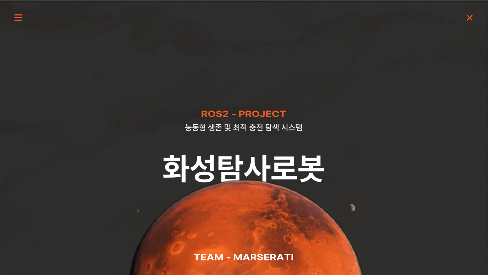

# ROS_project_mars
Mars_explore_robot(charging_algorithm)

## Project Structure

- arduino/ : Sensor data acquisition (CDS, IMU)
- python/  : Serial parsing and DB storage
- db/      : Database schema and queries

## Serial Permission
```bash
sudo usermod -a -G dialout $USER
reboot
```

## 🚀 Project Presentation

> ROS기반 화성 탐사 로봇 발표자료

[](./MARS_PROJECT_final.pdf)
